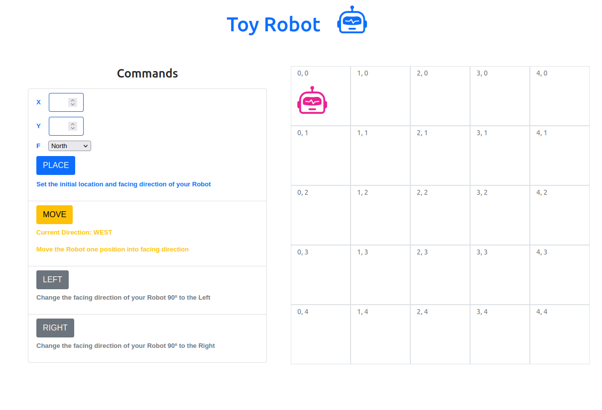

# Toy Robot

This Web Applcation consists in a simulation of a toy robot moving on a square tabletop, of dimensions 5x5. The Robot can move one position at time to north, south, west or east, but cannot move outside of the table.

## Live

## Running Locally

### Prerequisits

- [Ruby](https://www.ruby-lang.org/en/)
- [Ruby on Rails](https://rubyonrails.org/)

### Installation

- Clone this repo in a folder of your choice using this command: `git clone git@github.com:thneves/toy-robot.git`
- Open the terminal in the folder specified.
- Type: `bundle install` to install the packages.

Setup database

 - Type:  `rails db:create`
 - Type:   `rails db:migrate`

Opening server:

- Type: `rails s`
- Open `http:localhost:3000`